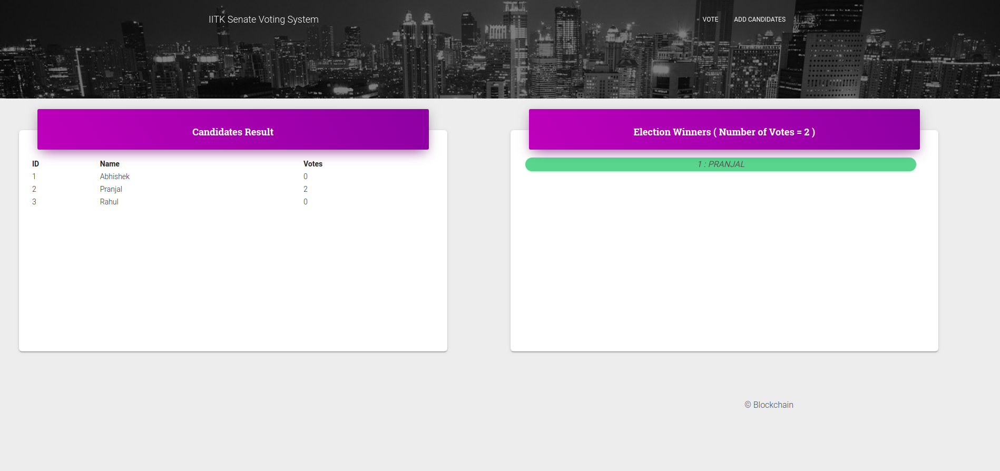

# Ethereum Voting System
## Youtube Demo Video :
[](https://www.youtube.com/watch?v=oJozUyqi3fY&feature=youtu.be)
## *Project Title*
* ### **Student Senate Voting Using Ethereum Blockchain**
## *Project Description*
* Our project will implement Student Senate Voting System using Blockchain technology.

* Project would provide a Graphical User Interface for registration of candidates , casting of votes and declaration of results.

* Each activity of registration , voting , result declaration would be considered as a transaction and would be recorded in the blockchain.

* Privacy will be provided to voters as only their vote will be recorded but not mapped.

* Various validation will also be implemented so that only valid students can cast their votes and a student can cast vote only once , candidates do not cheat in any way , etc.
## Technology Used
* Ganache GUI
* Web3
* HTML
* CSS
* Javascript
* Node JS
* Solidity
* Metamask Plugin
* Template For Website : Material Design Template
https://www.creative-tim.com/product/material-kit

## Run Project
Use Linux System

* Clone Repository 
```
git clone https://github.com/ft-abhishekgupta/ethereum-dapp-votingsystem
```

* Download Ganache GUI (AppImage File)

### Install Dependencies
```
sudo apt-get install curl python-software-properties
curl -sL https://deb.nodesource.com/setup_10.x | sudo -E bash -
sudo apt-get install nodejs
```
* Open Ganache GUI
    * New Workspace
    * Port - 8545
    * Gas Limit 5000000000
    * Gas Price 200


### Open terminal in Directory
```
npm install web3@1.0.0-beta.37 solc@0.5.3
npm init
```
Delete **node_modules/websocket** folder
```
npm install
node_modules/.bin/solcjs --bin --abi Election.sol
```
* Run Ganache GUI with port address 8545  

* Install Metamask Extention in Chrome / Firefox. 
    * Create Account
    * Set Network to Localhost 8545

**Launch Node Console ```node```**

### Inside Node Console
Copy 1st Ethereum Address from Ganache to last command below (From:...)
```
Web3 = require('web3');

web3 = new Web3("http://localhost:8545");

bytecode = fs.readFileSync('Election_sol_Election.bin').toString();

abi = JSON.parse(fs.readFileSync('Election_sol_Election.abi').toString());

deployedContract = new web3.eth.Contract(abi);

deployedContract.deploy({data: bytecode,arguments:[web3.utils.asciiToHex("SenateElections")]}).send({from:'0xEb32Fc57A3c9A7cadeFaab2858634a1f1d1b42f4',gas:3000000,gasPrice:web3.utils.toWei('0.00003','ether')}).then((newContractInstance)=>{deployedContract.options.address=newContractInstance.options.address;console.log(newContractInstance.options.address)});
```
* Copy Deployed Contract Address :
    * (Displayed on last command) or (from Ganache GUI Transaction Section)
    * Paste it into *main.js*

* Select Account in Metamask by Copying Private Key from Ganache and Importing it to metamask

* Finally Open ```home.html ```

----
## Screenshots





---

    